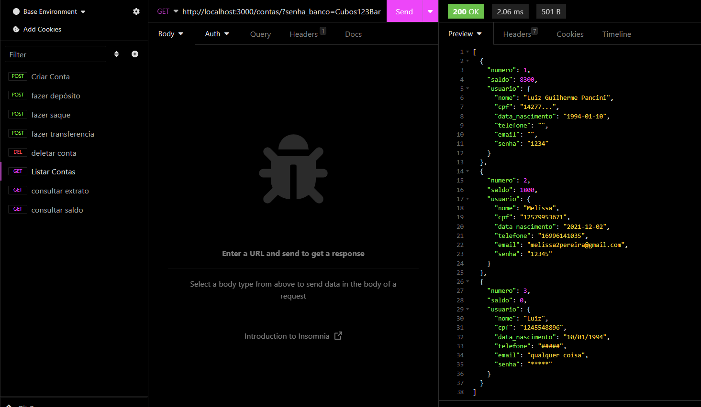
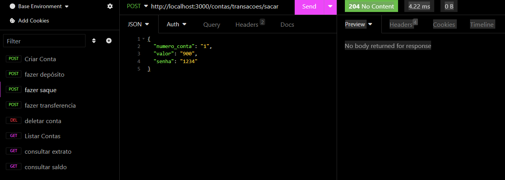
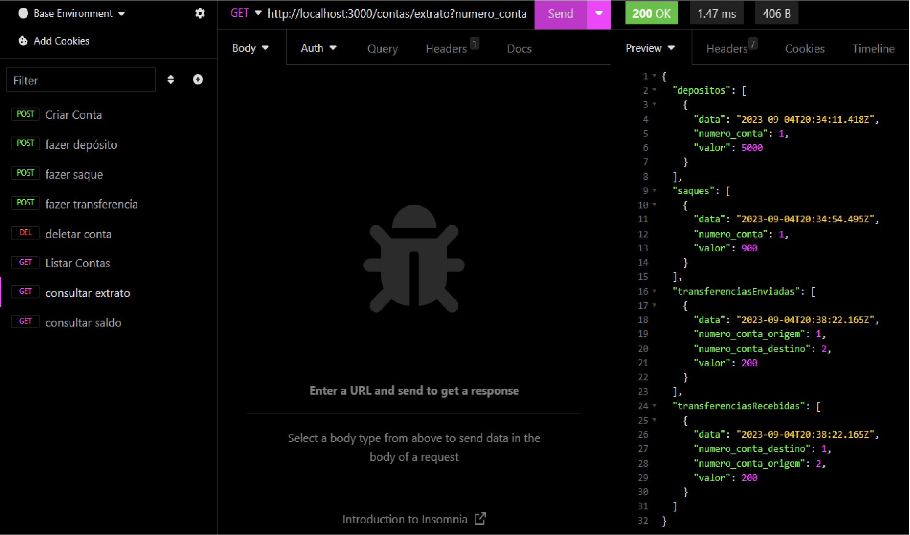

<div align = "center">
  

</div>

<h1 align="center">  Bank-API-REST </h1>
<p align="center">
  
</p>

## Descrição do Projeto

Olá! Este é o README para a API do Cubos Bank, um projeto que eu desenvolvi como parte do Desafio Módulo 2 - Back-end. A ideia é criar uma API para um Banco Digital, onde os clientes possam criar contas, fazer transações e verificar seus saldos e extratos.

## Configuração do Projeto
### Clonando o repositório

Primeiro, clone este repositório para sua máquina usando o comando:

```bash
git clone https://github.com/SEU_USUARIO/desafio-modulo-2-backend.git
 ```

### Instalando as dependências
Depois de clonar o repositório, acesse a pasta do projeto:

```bash
cd desafio-modulo-2-backend
```
Instale as dependências necessárias executando:

```
npm install
```
### Iniciando o servidor
Agora, você está pronto para iniciar o servidor. Use o seguinte comando:
```
npm start
```
Isso irá iniciar a API, e ela estará pronta para receber suas solicitações.

## Uso da API
A API possui vários endpoints que você pode acessar para realizar diferentes operações bancárias. Vou explicar os principais:

+ ### Listar contas bancárias
  
  Para listar todas as contas bancárias existentes, você pode fazer uma requisição GET para o seguinte endpoint:

```bash
GET /contas?senha_banco=SENHA_BANCO
````
  ***Lembre-se de substituir SENHA_BANCO pela senha do banco.***


+ ###  Criar conta bancária

  Para criar uma nova conta bancária, envie uma solicitação POST para:

```bash

 POST /contas
```

Você precisará enviar os detalhes da conta no corpo da solicitação em formato JSON.

+###  Atualizar usuário da conta bancária
   
  Se um cliente desejar atualizar seus detalhes de conta, isso pode ser feito com uma solicitação PUT para:

```
PUT /contas/:numeroConta/usuario
```
   Substitua :numeroConta pelo número da conta que deseja atualizar e envie os novos detalhes no corpo da solicitação.

+ ### Excluir Conta

  Para excluir uma conta bancária, faça uma solicitação DELETE para:

```bash
DELETE /contas/:numeroConta
```

Substitua :numeroConta pelo número da conta que deseja excluir.

+ ### Depositar
  
  Você pode fazer depósitos em uma conta bancária enviando uma solicitação POST para:

```bash

POST /transacoes/depositar
```

  Forneça o número da conta e o valor do depósito no corpo da solicitação.

+ ### Sacar
Para realizar saques, use uma solicitação POST para:

```bash

POST /transacoes/sacar
```
Forneça o número da conta, o valor do saque e a senha no corpo da solicitação.

+ ### Transferir
Para transferir dinheiro entre contas, envie uma solicitação POST para:

```bash

POST /transacoes/transferir
```
Forneça o número da conta de origem, o número da conta de destino, o valor da transferência e a senha no corpo da solicitação.

+ ### Saldo
Para verificar o saldo de uma conta, faça uma solicitação GET para:

```bash
GET /contas/saldo?numero_conta=NUMERO_CONTA&senha=SENHA
```
Substitua NUMERO_CONTA pelo número da conta e SENHA pela senha.

+ ### Extrato
Para obter o extrato de uma conta, faça uma solicitação GET para:

```bash
GET /contas/extrato?numero_conta=NUMERO_CONTA&senha=SENHA
```
***Substitua NUMERO_CONTA pelo número da conta e SENHA pela senha.***


## Status Codes
  
A API retorna diferentes status codes para indicar o resultado de uma solicitação. Aqui estão alguns dos principais:

- 200 (OK): Requisição bem-sucedida;
- 201 (Created): Requisição bem-sucedida e algo foi criado;
- 204 (No Content): Requisição bem-sucedida, sem conteúdo no corpo da resposta;
- 400 (Bad Request): Erro na requisição devido a uma sintaxe/formato inválido ou falha na validação;
- 401 (Unauthorized): O usuário não está autenticado (logado);
- 403 (Forbidden): O usuário não tem permissão para acessar o recurso solicitado;
- 404 (Not Found): O servidor não pode encontrar o recurso solicitado;
- 500 (Internal Server Error): Erros causados pelo servidor;
  
## Persistência de Dados
Os dados são armazenados em memória, no objeto existente dentro do arquivo bancodedados.js. Todas as transações e contas bancárias são inseridas dentro deste objeto.

## Incrementos Futuros

 - Melhorar o formato da data na extrato; 

 - Corrigir possíveis bugs no extrato;

-  Adicionar a opção de fazer Pix entre contas; 

 - Acrescentar a opção de conta poupança.

## Conclusão
Este é um resumo da API do Cubos Bank, que permite realizar operações bancárias básicas. Sinta-se à vontade para explorar e testar os endpoints. 

###### tags: `back-end` `módulo 2` `nodeJS` `API REST` `desafio`
